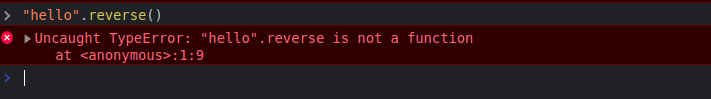

## Introduction


The website only shows an input, which seams a flag input, a button, and a youtube link that takes you to a short where contains a Family Guy clip that his subjct is basically resumed as "What is everything" indicating something is not what it looks.

## Analysis

Opening the source code of the website we spot this Javascript script

```html
<script>

      // define a `SECRET` variable that's equal to the concatenation of the ASCII of each of those numbers 
      const SECRET = [
        123, 84, 153, 85, 104, 131, 153, 131, 144, 105, 141, 131, 86, 131, 88, 131,
        135, 84, 136, 105, 150, 131, 84, 150, 131, 114, 88, 140,
      ]
        .map(c => String.fromCharCode(c))
        .join('')

      // retrieve the form object
      const form = document.querySelector('form')

      // add a behavioyr once submitting the form
      form.addEventListener('submit', function validate(e) {
        e.preventDefault()
        
        // retrieve the submitted flag as the variabel `flag`
        const formData = new FormData(e.target)
        const flag = formData.get('flag')


        // encrypt the flag
        const encrypted_flag = flag
          .reverse() // reverse it
          .map(c => String.fromCharCode(c.charCodeAt(0) ^ 45)) // XOR each char with 45
          .join('') // concatenate the chars

        if (encrypted_flag !== SECRET) {
          alert(false)
        } else {
          alert(true)
        }
      })

</script>

```

So basically we have to XOR the Secret with 45, and then reverse the result, and then submit it as a flag.

attempting to do so, we get

```py
SECRET = [
    123, 84, 153, 85, 104, 131, 153, 131, 144, 105, 141, 131, 86, 131, 88, 131,
    135, 84, 136, 105, 150, 131, 84, 150, 131, 114, 88, 140,
]

flag = [c ^ 45 for c in SECRET]
flag = [chr(c) for c in flag]
flag = flag[::-1]
flag = ''.join(flag)

print(flag)

# ¡u_®»y®»D¥yª®u®{® D½®´®Ex´yV
```

Clearly, this doesn't look like what we are looking for, plus once submitting we don't get the `true` alert.
So something is wrong, and we need to find out what.

Having importing a large chunk of javascript that appears to be the `lodash` library so not much to conclude, just a large webpack bundle.

attempting to try to execute the instructions inside the console, we get hit with this output:


This is not what a reversed string would look like, so we need to find out what is going on. 

Trying to execute the instructions inside a different console, or just a node environment, we get hit with this output:



Which means, there's no such thing as a `reverse` function in javascript. An interesting fact is that the `reverse()` function only exists in the `Array` object, and not in the `String` object, which is something not anyone would spot.

Another thing, when trying the `map` function, we get this:


Which is obviously not what it's supposed to be, and we can conclude that the `map` function is not acting as expected to do.

So something is wrong with the code we see, and it doesn't look like it's doing. Maybe this is what the youtube video is about, and we need to find out what is going on.

A note for who doesn't know, All functions that's attached to a String, Number, or any kind of object in Javascript, are defined in the `prototype` of the object, so to access any of the function we can type `String.prototype.reverse` in the console for example.

And we get this:

```js
String.prototype.reverse = function() {
    const t = new TextEncoder().encode(this.toString());
    let n = [];
    for (let o = 0; o < t.length; o++)
        n.push(String.fromCharCode(t[o] + 36));
    return n
}
```

So basically, the `reverse` function is a function that takes a string, and then encodes it to a `TextEncoder` (similar to what we would do in python by making it a `bytes` array), and then it adds 36 to each character, and then it returns the result.

Moreover, if you double click and the output it will take you to the source code of the function, and you will see that the function is defined inside the javascript chunk, alongside with this code:

```js
String.prototype.charCodeAt = function(i) {
    return 45
}

Array.prototype.map = function(i) {
    return this
}
```

So basically, the `map` function is not doing anything, and the `charCodeAt` function is always returning 45.
The code is deeply hidden between those chunks of code, and it's not easy to spot.


## Exploitation

Anyways, based on what we have, we try to reverse the "corrupted" code, and we get this:

```py

SECRET = [
    123, 84, 153, 85, 104, 131, 153, 131, 144, 105, 141, 131, 86, 131, 88, 131,
    135, 84, 136, 105, 150, 131, 84, 150, 131, 114, 88, 140,
]

# the map is not changing anything so we ignore it
flag = [c - 36 for c in SECRET]
flag = [chr(c) for c in flag]
flag = ''.join(flag)

print(flag)

# W0u1D_u_lEi_2_4_c0dEr_0r_N4h
```

When submitting this, we get the `true` alert, Thus we have solved the challenge.

## Conclusion

The point of this challenge, is that you need to be able to inspect the code, and find out what is going on, even though the code is literally in your browser, and in front of you.


## Flag
> `Securinets{W0u1D_u_lEi_2_4_c0dEr_0r_N4h}`

## Unintended Solution

Someone reversed the behaviour of the `reverse` function itself.


```py
inp = b"ABCDEFGHIJKLMNOPQRSTUVWXYZabcdefghijklmnopqrstuvwxyz0123456789!@#$%^&*()_+\|?><"
out = ['e', 'f', 'g', 'h', 'i', 'j', 'k', 'l', 'm', 'n', 'o', 'p', 'q', 'r', 's', 't', 'u', 'v', 'w', 'x', 'y', 'z', '{', '|', '}', '~', '\x85', '\x86', '\x87', '\x88', '\x89', '\x8A', '\x8B', '\x8C', '\x8D', '\x8E', '\x8F', '\x90', '\x91', '\x92', '\x93', '\x94', '\x95', '\x96', '\x97', '\x98', '\x99', '\x9A', '\x9B', '\x9C', '\x9D', '\x9E', 'T', 'U', 'V', 'W', 'X', 'Y', 'Z', '[', '\\', ']', 'E', 'd', 'G', 'H', 'I', '\x82', 'J', 'N', 'L', 'M', '\x83', 'O', ' ', 'c', 'b', '`']
out = [ord(c) for c in out]

SECRET = [
    123, 84, 153, 85, 104, 131, 153, 131, 144, 105, 141, 131, 86, 131, 88, 131,
    135, 84, 136, 105, 150, 131, 84, 150, 131, 114, 88, 140,
]

mapped = dict(zip(out, inp))

def reverse(s):
    return ''.join(chr(mapped.get(c, c)) for c in s)

print(reverse(SECRET))

# W0u1D_u_lEi_2_4_c0dEr_0r_N4h
```